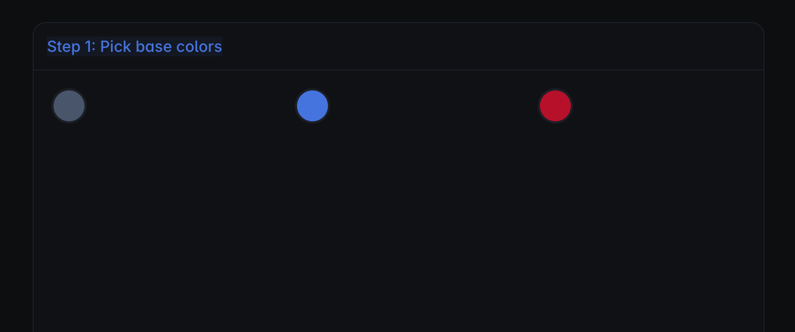
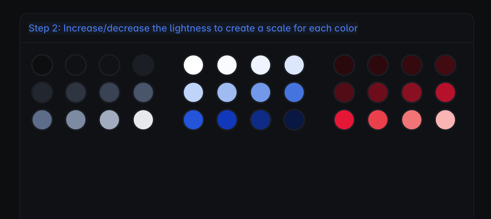
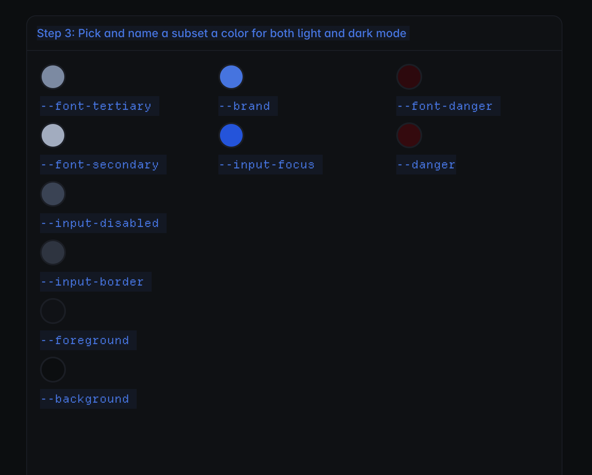
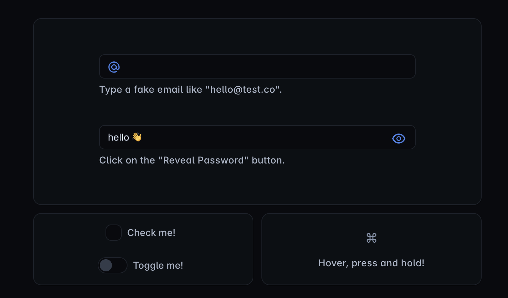

### Notes for Building a Design System from scratch
[original blog post](https://blog.maximeheckel.com/posts/building-a-design-system-from-scratch/)

### Context - why build a personal design system
- Branding
- Consistency
- Fun and learning

My own set of Lego pieces

### Tokens - discrete elements
- color palette
- spacing
- typography
- font sizes
- shadows

#### Color system
Two-tier color variable system:
1. variables representing HSL(hue, saturation, lightness) values of the colors, for example `--blue-1-: '222, 89%, 90%'`
2. alias or meaning mapped variables, like `--brand: hsl(var(--blue-50))`. Use the colors defined in the first layer and compose them or expand.

This system works for 2 reasons:
1. components never references actual colors, rather they use alias, like `--brand`. This makes components resilient, because all I have to do is update the `--brand` variable, and all the components referencing it will update accordingly.
2. enables color token composition: [detail here](https://blog.maximeheckel.com/posts/the-power-of-composition-with-css-variables/)
3. theming becomes easier. Like light and dark, in light mode `--brand` refers to `--blue-60`, in dark mode it refers to `--blue-20`

#### Steps to pick colors, create a palette, and tokens:
1. 
2. 
3. 

#### other tokens
- spacing tokens `--space-0: 0px; --space-1: 4px; ... --space-12: 96px`

Noticed it uses a scale factor of 4 up to --space-4: 16px, and then becomes less granular at larger sizes. 

***systematic alternative*** similar to tailwind's convention  

strict 4px scale:
`--space-0: 0;
--space-1: 4px;
--space-2: 8px;
--space-3: 12px;
--space-4: 16px;
--space-5: 20px;
--space-6: 24px;
--space-8: 32px;
--space-10: 40px;
--space-12: 48px;
--space-16: 64px;
--space-20: 80px;
--space-24: 96px;`

#### a good rule to guide my design system:  

space-1 to space-4: internal element spacing  
space-5 to space-7: component padding and gaps  
space-8 to space-12: page and section spacing  

#### typography tokens
`--font-size-1: 0.75rem;
--font-size-2: 0.875rem;
--font-size-3: 1rem;
--font-size-4: 1.125rem;
--font-size-5: 1.25rem;
--font-size-6: 1.5rem;
--font-size-7: 2rem;`

#### radii tokens
`--border-radius-0: 4px;
--border-radius-1: 8px;
--border-radius-2: 16px;`

#### naming-convention
1. size-related token sets, using numerical suffixes with increments of 1
2. tokens that needs more granularity in the future, like color scales. The numerical suffixes with increments of 10 / 100

### Component patterns
- focus on developer experience (DX)
- cohesive design/design language

#### variant driven components
a variant driven component is a component that has a set of predefined visual differences. 
```js
<Button variant="primary" size="md" />
<Button variant="secondary" size="sm" />
<Button variant="ghost" size="lg" />
```

instead of this:
```js
<Button background="blue" color="white" padding="12px 16px" />
<Button background="hotpink" color="white" padding="8px 12px" />
<Button border="1px solid red" fontSize="13px" />
```

Dynamic styling props = users can pass almost anything
variant driven = design system defines the allowed choices

API is product decision, not just a css decision
```js
<Button
  variant="primary | secondary | ghost | danger"
  size="sm | md | lg"
  tone="neutral | brand | destructive"
/>
```
components should expose a small, intentional API of visual choices, instead of letting every usage invent its own styling

#### lessons
1. predefined states beat random styling props
2. variants create type-safe component APIs ``` variant="primary | secondary | ghost | danger" ```
3. variants force you to think in system: has a small number of meaningful axes
   Button:
   - variant: primary, secondary, ghost, danger
   - size: sm, md, lg
   - loading: true, false
   - disabled: native disabled


#### utility components
- Box
- Flex
- Grid
- Text
- VisuallyHidden

#### compound components
Two use cases to opt for compound components:
1. Overloaded prop interface, split into smaller related components
2. Components could potentially be composed in many ways

 - Radio
 - Card

#### polymorphism and composition
Polymorphism gives components rendering flexibility.
Composition gives the system reusable layers of abstraction.

Polymorphism = "what does this component render as"
```js
<Text as="p">Hello</Text>
<Text as="h1">Hello</Text>
<Card.Body as={Flex} direction="column" gap="2" />
```

Composition = "how do we build bigger/narrower components by combining smaller primitives?"
Design pattern of wrapping/reusing primitives to create more specific components.

```js
const Heading = (props) => (
  <Text
    as="h1"
    size={headingSize[props.size]}
    css={...}
  />
);
```

#### mental model 
```text
Primitive:
Text

Polymorphic use:
Text can render as p, h1, span, label, etc.

Composed abstraction:
Heading uses Text internally but gives it heading-specific defaults.

Narrow composed abstraction:
H1 uses Heading internally and fixes as="h1" and size="4".
```

In this example: 
```js
<Card.Body as={Flex} direction="column" gap="2" />
```

polymorphism and composition are both happending:
- polymorphism is rendering the `Card.Body` as `Flex`
- composition is `Card.Body` reuse `Flex` behavior

#### tradeoff: 

```text
Too much polymorphism = flexible but easier to misuse.
Good composition = fewer props, clearer intent, faster usage.
Too much composition = too many tiny components and unclear hierarchy.
```


#### make it shine

- the favicon next to the anchor links
- the slight border around cards makes them stand out
- programmatic and layered shadow system
- micro-interactions - icon animations  
- 

#### packaging and shipping
- packing patterns
- file structure
- bundling and releasing

#### versioning
one packaging for the design system 
   - tradeoff:
   - pro: simplicity - one package to import and use the design system
   - con: tree shakable so importing one component of the design system would not result in a big increase in bundle size   

additional reading: [Design system versioning](https://bradfrost.com/blog/post/design-system-versioning-single-library-or-individual-components/)  

#### versioning decisions:  

`major` bump when significant a design language change occurs or when a breaking change in the code is shipped.
`minor` bump when a new component or new tokens are added to the design system.
`patch` bump when some existing components/tokens are updated or when a fix is shipped.