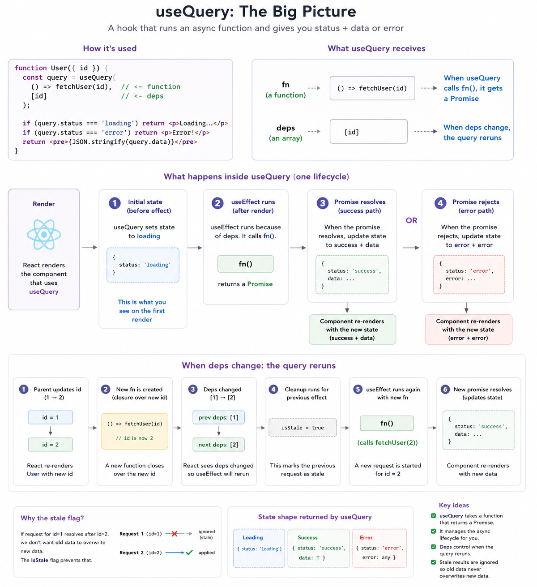

### What is useQuery
`useQuery` is a custom React hook pattern for fetching data and tracking the request state.
`useQuery` receives a function, not a promise. The function returns a promise and can close over values from the current render, like id.  

When `id` changes:
1. React re-renders the component that calls `useQuery` hook
2. A new query function is created. `() => callback(id)`
3. The deps array changes from [1] to [2]
4. `useQuery` immediately returns the current request state for the render.
5. useEffect runs because the deps change. 
6. Inside `useEffect`, `useQuery` calls the new function. `fn()`
7. callback(2) returns a Promise

It answers three questions for the component:

1. is the request still loading?
2. did the request fail?
3. did the request succeed, and what data came back?

### What is it used for?

`useQuery` is used for server-state fetching.

That means data needs to be retrieved:
- API data
- database-backed data
- user profile data
- search results
- dashboard stats
- product lists

### The hook manages the async call lifecycle
start request -> loading
promise resolves -> success + data
promise rejects -> error + error object
dependency changes -> run again
component unmounts -> avoid unsafe stale updates

### Mental model

Think of useQuery as a request state machine.

Before request finishes:
{ status: "loading" }

If request succeeds:
{ status: "success", data }

If request fails:
{ status: "error", error }